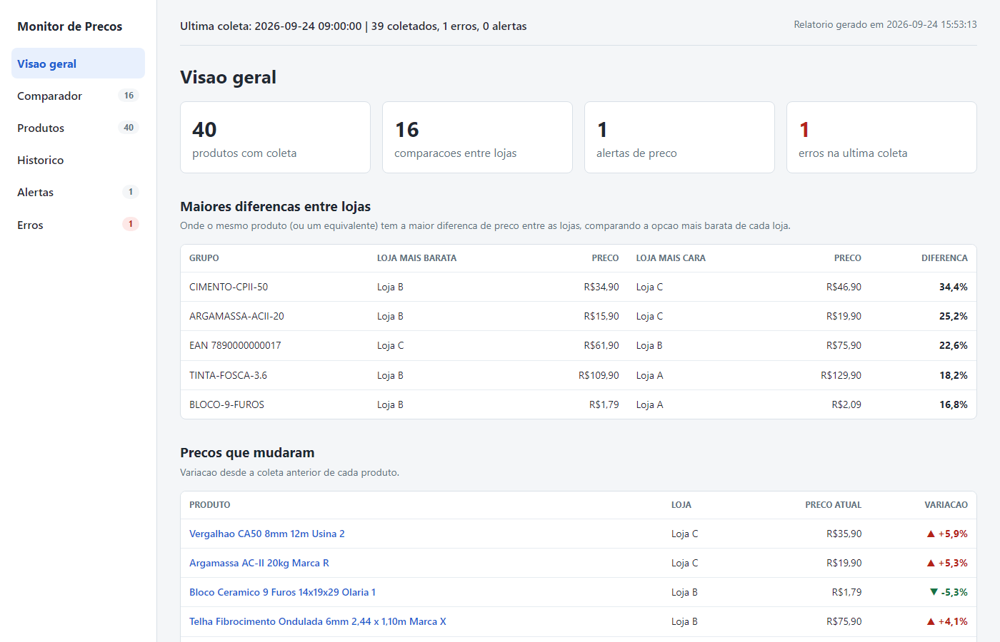
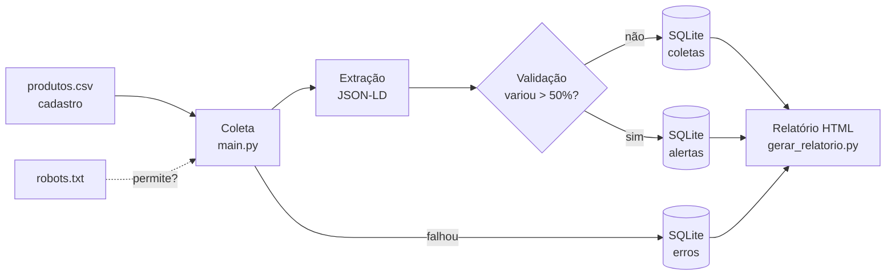

<div align="center">

# Monitor de Preços de Concorrentes

**Coleta diária e automática de preços da concorrência, com validação, histórico e comparativo entre lojas.**

[](https://github.com/dougvivian/price-monitor-web-scrapper/actions/workflows/testes.yml)


[](LICENSE)

[Experimente](#experimente-em-1-minuto) ·
[Como funciona](#como-funciona) ·
[Decisões técnicas](#decisões-técnicas)



<sub>Imagem do modo demonstração, com lojas e produtos fictícios.</sub>

</div>

## Experimente em 1 minuto

O modo demonstração cria um banco com 3 lojas fictícias e 30 dias de histórico
simulado e gera o relatório. Não acessa nenhum site.

```bash
git clone https://github.com/dougvivian/price-monitor-web-scrapper.git
cd price-monitor-web-scrapper
pip install -r requirements.txt
python src/demo.py
```

Depois, abra `relatorios/demo.html` no navegador.

## Como funciona



1. O **cadastro** (`produtos.csv`, editável no Excel) lista as páginas dos produtos.
2. A **coleta** confere o `robots.txt`, baixa cada página e lê o JSON-LD. Uma falha vira
   registro na tabela `erros` e a coleta segue para o próximo produto.
3. A **validação** compara com o último preço: variação acima de 50% vira alerta e só é
   aceita se o mesmo preço aparecer de novo na coleta seguinte.
4. O **relatório** junta tudo numa página com as abas Visão geral, Comparador,
   Produtos, Histórico, Alertas e Erros.

## Como rodar com os seus produtos

Requisitos: Python 3.10 ou superior.

```bash
# 1. Instalar as dependências
pip install -r requirements.txt

# 2. Criar o cadastro a partir do modelo e preencher com os seus produtos
cp dados/produtos.exemplo.csv dados/produtos.csv

# 3. Coletar os preços (acessa o site das lojas)
python src/main.py

# 4. Gerar o relatório a partir do banco de dados
python src/gerar_relatorio.py
```

Depois, abra `relatorios/relatorio.html` no navegador.

O cadastro (`produtos.csv`) tem as colunas `produto_id`, `concorrente`, `url`, `sku`,
`ativo`, `categoria`, `observacao` e `grupo`. O `grupo` é opcional: produtos com o
mesmo código são comparados entre si.

<details>
<summary><b>Coleta automática diária (Agendador de Tarefas do Windows)</b></summary>
<br>

O script `src/coleta_diaria.py` roda a coleta e gera o relatório em sequência, gravando
tudo em `logs/coleta_diaria.log`. Para rodar sozinho todo dia, cadastre no Agendador de
Tarefas (no Prompt de Comando):

```bat
schtasks /Create /TN "Monitor de Precos - coleta diaria" /SC DAILY /ST 09:00 ^
  /TR "\"C:\caminho\para\pythonw.exe\" \"C:\caminho\do\projeto\src\coleta_diaria.py\""
```

`pythonw.exe` é o Python sem janela de terminal, para a coleta rodar em segundo plano.

</details>

### Testes

```bash
python -m pytest
```

Os testes usam páginas HTML sintéticas e um site falso no lugar do `requests.get`,
então não acessam a internet. Eles também rodam no **GitHub Actions** a cada push.

## Estrutura

```text
src/
  main.py               coleta os preços, extrai os dados da página e valida
  banco.py              acesso ao banco SQLite (todo o SQL do projeto fica aqui)
  gerar_relatorio.py    gera o relatório HTML
  coleta_diaria.py      roda coleta + relatório e grava log (usado no agendamento)
  demo.py               modo demonstração com dados fictícios
  relatorio/
    estilo.css          visual do relatório (cores e espaçamentos em variáveis no topo)
    interacao.js        abas, filtros e ordenação (JavaScript puro)
dados/
  produtos.exemplo.csv  modelo do cadastro de produtos
  produtos.csv          cadastro real (fora do Git)
  monitor.db            banco SQLite: coletas, erros, alertas, execucoes (fora do Git)
relatorios/             relatórios gerados (fora do Git)
tests/                  testes com pytest e páginas HTML sintéticas
```

## Como o preço é extraído

O monitor lê o **JSON-LD** da página: dados estruturados no padrão
[schema.org](https://schema.org/Product) que as lojas publicam para o Google. Não
depende do visual da página, e o mesmo código funciona em lojas **VTEX** e **Shopify**.
Quando o produto tem variações, a oferta certa é escolhida pelo SKU; se não der para
saber qual é, o monitor registra erro em vez de arriscar um preço.

## Decisões técnicas

- **JSON-LD em vez de seletores CSS:** a primeira versão salvava o preço da variação
  errada em produtos com várias medidas. O JSON-LD traz uma oferta por SKU e resolveu.
- **Erro visível em vez de preço chutado:** dado duvidoso vira erro no relatório, não
  um preço errado salvo em silêncio.
- **Validação com confirmação:** variação acima de 50% vira alerta; se o mesmo preço
  aparecer de novo, é aceito, para um aumento real não ficar bloqueado.
- **EAN validado pelo dígito verificador:** uma loja colocava o código do SKU no campo
  do EAN. Só códigos de barras válidos são aceitos.
- **Comparação entre lojas:** o mesmo produto é casado pelo EAN; equivalentes de marcas
  diferentes, por um `grupo` no cadastro.
- **SQLite:** um arquivo só, sem servidor, com consultas SQL e migração automática de
  colunas.
- **Relatório em um arquivo só:** CSS e JavaScript ficam em arquivos próprios e são
  copiados para dentro do HTML, que pode ser enviado sozinho.
- **Testes sem internet:** páginas sintéticas e um site falso com `monkeypatch`.
- **Dados reais fora do repositório:** o cadastro real, o banco e os relatórios não vão
  para o Git.

## Limitações conhecidas

- Páginas incompletas do site: alguns produtos podem ficar sem coleta em certos dias.
- O `robotparser` do Python não entende curingas (`*`) no meio das regras do
  robots.txt; nesses casos a regra é tratada como texto comum.
- Em lojas Shopify, produtos com várias variações (`?variant=`) ainda não são tratados:
  o monitor registra "SKU ambíguo".
- A coleta agendada depende do computador ligado. No Agendador de Tarefas, a opção
  "executar assim que possível após perder um horário agendado" faz a coleta rodar
  quando o computador for ligado.

## Roadmap

- **v1 (concluída):** 1 site, execução manual.
  - [x] Coleta com tratamento de erros e histórico
  - [x] Relatório HTML
  - [x] Testes automatizados com páginas HTML sintéticas (sem acessar o site)
  - [x] Extração via dados estruturados da página (JSON-LD / schema.org)
  - [x] Validação dos dados (preço vazio ou variação absurda gera alerta)
  - [x] Histórico em SQLite
- **v2 (concluída):**
  - [x] Execução agendada diária (Agendador de Tarefas do Windows)
  - [x] Respeito automático ao robots.txt
  - [x] EAN dos produtos, validado pelo dígito verificador
  - [x] Testes automáticos no GitHub Actions
  - [x] Segundo concorrente (outra plataforma, mesmo extrator)
  - [x] Comparativo entre lojas no relatório (EAN + grupo de equivalência)
  - [x] Relatório com abas, gráfico de histórico e modo demonstração
- **v3:** alertas de mudança de preço por Telegram/e-mail.

## Tecnologias

Python, requests, BeautifulSoup, SQLite (SQL), pytest, GitHub Actions,
HTML/CSS/JavaScript, SVG.
