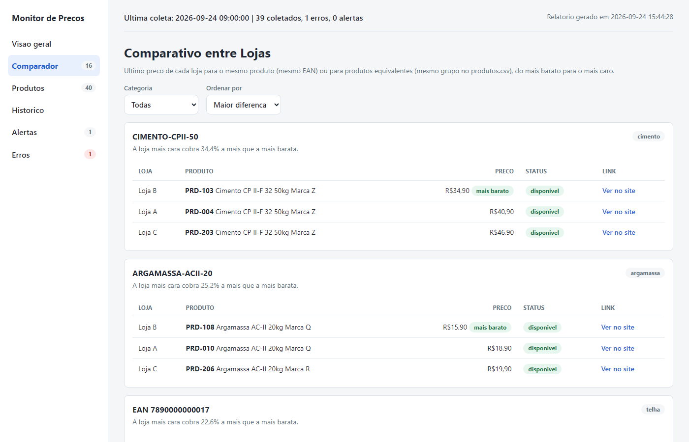
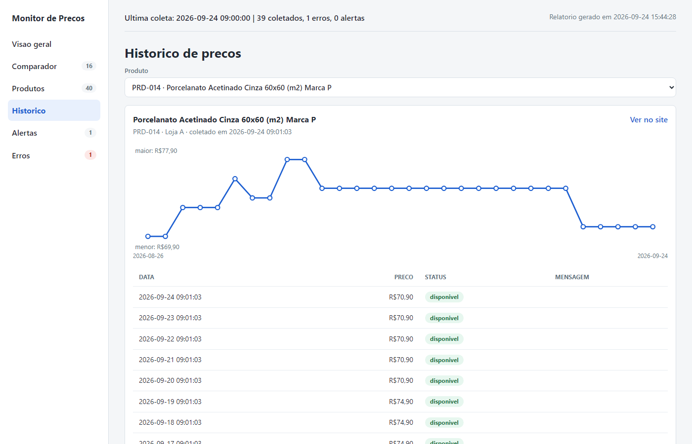
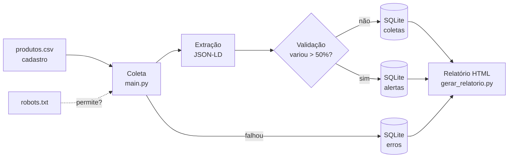

# Monitor de Preços de Concorrentes


Ferramenta em Python que coleta automaticamente os preços de produtos em sites de
concorrentes do varejo de materiais de construção, valida os dados, guarda o histórico
e gera um relatório HTML com comparativo entre lojas.

Nasceu de um problema real do meu trabalho: pesquisar preços da concorrência
manualmente, produto por produto. Hoje a coleta roda sozinha todo dia de manhã.


> As imagens são do **modo demonstração**, com lojas e produtos fictícios.

## Experimente em 1 minuto

O modo demonstração cria um banco com 3 lojas fictícias e 30 dias de histórico
simulado (preços subindo e caindo, promoção, produto indisponível, alerta e erros) e
gera o relatório. Não acessa nenhum site.

```bash
pip install -r requirements.txt
python src/demo.py
```

Depois, abra `relatorios/demo.html` no navegador.

## O que ele faz

- **Coleta:** lê a lista de produtos em `dados/produtos.csv`, acessa a página de cada um
  e extrai nome, preço, disponibilidade e EAN dos dados estruturados da página (JSON-LD).
- **Coleta responsável:** respeita o `robots.txt` de cada site, faz pausas entre os
  acessos e tenta de novo uma única vez.
- **Validação:** um preço que varia mais de 50% vira alerta e não entra no histórico,
  a menos que se confirme na coleta seguinte.
- **Histórico:** cada coleta vai para um banco SQLite. Falhas ficam registradas sem
  interromper a coleta dos outros produtos.
- **Comparativo entre lojas:** casa o mesmo produto pelo EAN (código de barras)
  automaticamente, e produtos equivalentes de marcas diferentes por um `grupo`
  definido no cadastro.
- **Relatório:** uma página com menu lateral e abas.
  - **Visão geral:** indicadores, maiores diferenças de preço entre lojas e preços que mudaram.
  - **Comparador:** do mais barato para o mais caro, com filtro por categoria.
  - **Produtos:** busca, filtros e ordenação por coluna.
  - **Histórico:** gráfico de linha de cada produto.
  - **Alertas** e **Erros:** os da última coleta separados dos anteriores.
- **Automação:** roda sozinho todo dia (Agendador de Tarefas do Windows) e grava log.

O relatório é um arquivo só (o CSS e o JavaScript vão dentro dele), funciona no celular
e tem modo escuro automático.

| Comparador | Histórico |
|---|---|
|  |  |

## Como funciona



## Como rodar com os seus produtos

Requisitos: Python 3.10 ou superior.

```bash
# 1. Instalar as dependências
pip install -r requirements.txt

# 2. Criar o cadastro a partir do modelo e preencher com os seus produtos
cp dados/produtos.exemplo.csv dados/produtos.csv

# 3. Coletar os preços (acessa o site das lojas)
python src/main.py

# 4. Gerar o relatório a partir do banco de dados
python src/gerar_relatorio.py
```

Depois, abra `relatorios/relatorio.html` no navegador.

O cadastro (`produtos.csv`) é editável no Excel e tem as colunas `produto_id`,
`concorrente`, `url`, `sku`, `ativo`, `categoria`, `observacao` e `grupo`. O `grupo` é
opcional: produtos com o mesmo código são comparados entre si.

### Coleta automática diária

O script `src/coleta_diaria.py` roda a coleta e gera o relatório em sequência, gravando
tudo em `logs/coleta_diaria.log`. Para rodar sozinho todo dia no Windows, cadastre no
Agendador de Tarefas (no Prompt de Comando):

```bat
schtasks /Create /TN "Monitor de Precos - coleta diaria" /SC DAILY /ST 09:00 ^
  /TR "\"C:\caminho\para\pythonw.exe\" \"C:\caminho\do\projeto\src\coleta_diaria.py\""
```

`pythonw.exe` é o Python sem janela de terminal, para a coleta rodar em segundo plano.

### Testes

```bash
python -m pytest
```

Os testes usam páginas HTML sintéticas em `tests/paginas/` e um site falso no lugar
do `requests.get`, então não acessam a internet. Eles também rodam no **GitHub
Actions** a cada push (`.github/workflows/testes.yml`).

## Estrutura

```text
src/
  main.py               coleta os preços, extrai os dados da página e valida
  banco.py              acesso ao banco SQLite (todo o SQL do projeto fica aqui)
  gerar_relatorio.py    gera o relatório HTML
  coleta_diaria.py      roda coleta + relatório e grava log (usado no agendamento)
  demo.py               modo demonstração com dados fictícios
  relatorio/
    estilo.css          visual do relatório (cores e espaçamentos em variáveis no topo)
    interacao.js        abas, filtros e ordenação (JavaScript puro)
dados/
  produtos.exemplo.csv  modelo do cadastro de produtos
  produtos.csv          cadastro real (fora do Git)
  monitor.db            banco SQLite: coletas, erros, alertas, execucoes (fora do Git)
relatorios/             relatórios gerados (fora do Git)
tests/                  testes com pytest e páginas HTML sintéticas
docs/                   imagens do README
```

## Como o preço é extraído

Em vez de procurar o preço no visual da página (seletores CSS, que quebram quando o
layout muda), o monitor lê o **JSON-LD**: um bloco de dados estruturados no padrão
[schema.org](https://schema.org/Product) que as lojas publicam para o Google. Funciona
em qualquer loja que publique esse padrão; foi testado em lojas **VTEX** e **Shopify**.

Quando o produto tem variações (tamanhos, cores), a página lista uma oferta por SKU.
O monitor escolhe a oferta certa assim:

1. SKU preenchido na coluna `sku` do cadastro;
2. senão, o `?skuId=` do link;
3. senão, se a página tiver uma oferta só, usa essa;
4. senão, registra o erro "SKU ambíguo" em vez de arriscar um preço errado.

Produto fora de estoque fica como `indisponivel`, sem preço; o preço anunciado vai
para a mensagem, para consulta.

Nas lojas VTEX, a página também traz um objeto `__STATE__` com os dados de cada
variação. O monitor usa esse objeto só como complemento, para o nome completo da
variação e o EAN. O preço vem sempre do JSON-LD.

## Decisões técnicas

**JSON-LD em vez de seletores CSS.** A primeira versão lia o preço pelo HTML visível.
Em produtos com variações, o site devolvia o preço da variação padrão, e não a do link:
uma telha de R$87,90 era salva como R$61,90. Com o JSON-LD, que traz uma oferta por SKU,
o erro sumiu. Comparando os dois métodos no mesmo dia, 41 produtos bateram e todas as
diferenças eram casos de variação que o método antigo errava.

**Preço só do JSON-LD, sem "plano B".** Às vezes o site entrega a página incompleta,
sem JSON-LD. Os dados VTEX da página ainda têm o preço, mas não são um padrão.
Preferi registrar o erro (e tentar de novo uma vez) a depender de um formato próprio
da plataforma. Resultado: em alguns dias, alguns produtos ficam sem coleta.

**Erro visível em vez de preço chutado.** Página com várias variações e nenhum SKU
informado gera "SKU ambíguo". Produto fora de estoque não entra com preço. Um erro no
relatório é melhor que um preço errado salvo em silêncio.

**Validação com confirmação.** Variação acima de 50% vira alerta e não entra no
histórico. Mas, se só rejeitasse, um aumento real ficaria bloqueado para sempre. Por
isso o mesmo preço, visto de novo na coleta seguinte, é aceito.

**EAN validado pelo dígito verificador.** Uma das lojas preenchia o campo `gtin` do
produto com o código interno do SKU, e todas as medidas de uma telha ficavam com o
mesmo "EAN". Agora o monitor procura o EAN da variação primeiro e só aceita códigos
com dígito verificador válido.

**Comparação entre lojas: EAN automático + grupo manual.** O EAN casa sozinho o mesmo
produto em lojas diferentes. Mas produtos equivalentes de marcas diferentes (ex.: o
mesmo vergalhão CA50 10mm de outra usina) têm EANs diferentes e também interessam. Para
esses, a coluna `grupo` do cadastro dá o mesmo código aos equivalentes. A diferença de
preço compara **lojas**: a opção mais barata de cada uma.

**SQLite.** O histórico começou em CSV. O SQLite continua sendo um arquivo só, sem
servidor, mas dá consultas SQL (último preço de cada produto com `GROUP BY`), tipos de
dados e colunas novas sem quebrar o arquivo, com uma migração automática (`ALTER
TABLE`). O cadastro continua em CSV porque é editado à mão no Excel.

**Relatório em um arquivo só, mas editável.** O CSS e o JavaScript ficam em arquivos
próprios e são copiados para dentro do HTML na hora de gerar. Assim o relatório pode
ser enviado sozinho (e-mail, WhatsApp) sem perder o visual. O HTML de cada aba é
montado no Python, o que permite testá-lo com pytest; o gráfico é um SVG calculado no
próprio Python, sem biblioteca.

**Testes sem internet.** As páginas de teste são sintéticas e o `requests.get` é
trocado por um site falso (`monkeypatch`). Os testes são rápidos, repetíveis e não
incomodam os sites.

**Dados reais fora do repositório.** O cadastro real mostra quais produtos são
monitorados, uma informação comercial. Ele, o banco e os relatórios ficam fora do Git;
no repositório há só um modelo de cadastro, páginas de teste e uma demonstração com
dados fictícios.

## Coleta responsável

- Respeita o `robots.txt` seguindo a RFC 9309, com uma regra mais cuidadosa: se o
  próprio `robots.txt` responde 401 ou 403, o site é tratado como bloqueado.
- Pausa entre os acessos, uma única tentativa extra e uma execução por dia.
- Só acessa as páginas dos produtos cadastrados.
- **Não contorna proteções anti-robô.** Dois concorrentes que eu queria monitorar
  bloqueiam acessos automáticos (CAPTCHA). Eles ficaram de fora: o monitor detecta o
  bloqueio e não acessa o site, em vez de disfarçar o programa de navegador.

## Limitações conhecidas

- Páginas incompletas do site: alguns produtos podem ficar sem coleta em certos dias.
- O `robotparser` do Python não entende curingas (`*`) no meio das regras do
  robots.txt; nesses casos a regra é tratada como texto comum.
- Em lojas Shopify, produtos com várias variações (`?variant=`) ainda não são tratados:
  o monitor registra "SKU ambíguo".
- A coleta agendada depende do computador ligado (se estiver desligado às 9h, roda
  assim que for ligado).

## Roadmap

- **v1 (concluída):** 1 site, execução manual.
  - [x] Coleta com tratamento de erros e histórico
  - [x] Relatório HTML
  - [x] Testes automatizados com páginas HTML sintéticas (sem acessar o site)
  - [x] Extração via dados estruturados da página (JSON-LD / schema.org)
  - [x] Validação dos dados (preço vazio ou variação absurda gera alerta)
  - [x] Histórico em SQLite
- **v2 (concluída):**
  - [x] Execução agendada diária (Agendador de Tarefas do Windows)
  - [x] Respeito automático ao robots.txt
  - [x] EAN dos produtos, validado pelo dígito verificador
  - [x] Testes automáticos no GitHub Actions
  - [x] Segundo concorrente (outra plataforma, mesmo extrator)
  - [x] Comparativo entre lojas no relatório (EAN + grupo de equivalência)
  - [x] Relatório com abas, gráfico de histórico e modo demonstração
- **v3:** alertas de mudança de preço por Telegram/e-mail.

## Tecnologias

Python, requests, BeautifulSoup, SQLite (SQL), pytest, GitHub Actions,
HTML/CSS/JavaScript, SVG.

## Licença

[MIT](LICENSE)
